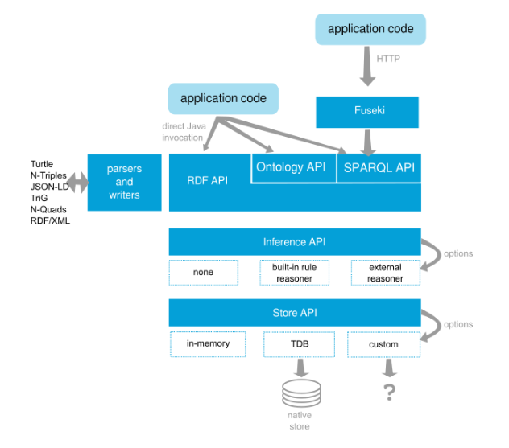

# What is Apache Jena?

Apache Jena is a free and open-source Java framework for building Semantic Web and Linked Data applications. It provides tools and libraries for working with RDF (Resource Description Framework), SPARQL (a query language for RDF), and OWL (Web Ontology Language), making it useful for creating and managing knowledge graphs, ontologies, and data integration systems.

---

## Why Do I Need Apache Jena?

Apache Jena is essential for developers and organizations looking to manage complex data relationships, ensure interoperability between data sources, and leverage Linked Data. It helps enrich data by linking it to external resources, and it offers scalability for handling large RDF datasets.

---

## Key Features of Apache Jena

- **RDF Support**: Enables creation, reading, and writing of RDF data in various formats.
- **SPARQL Query Engine**: Provides powerful querying capabilities for RDF data.
- **Ontology Management**: Supports OWL for defining and reasoning about domain-specific concepts.
- **TDB – Native Triple Store**: Offers scalable, persistent storage for RDF data.
- **Fuseki – SPARQL Server**: Publishes RDF data for querying over HTTP.
- **Inference and Reasoning**: Allows logical reasoning and data enrichment.
- **Extensibility**: Easily integrates with other technologies and can be customized for various applications.
- **Rich API**: Provides a well-documented API for programmatic RDF data manipulation and querying.

---

