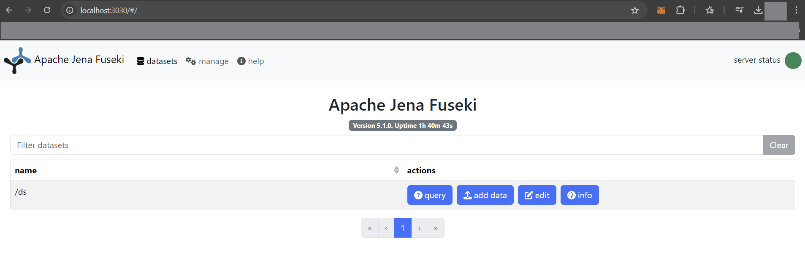

# Installing Apache Fuseki

This guide outlines the necessary steps to install and run Apache Jena Fuseki.

---

## 1. Download Apache Jena Fuseki

1. **Go to the Apache Jena Fuseki download page**:  
   Visit [Apache Jena Fuseki Downloads](https://jena.apache.org/download/index.cgi).
   
2. **Choose the latest version of Fuseki**:  
   Download the binary distribution as a `.zip` or `.tar.gz` file.

3. **Extract the archive**:  
   Extract the downloaded archive to your desired location.
   - On **Windows**: Use an extraction tool like 7-Zip or WinRAR.
   - On **Linux/Mac**: Use the terminal command:
     ```bash
     tar xzvf apache-jena-fuseki-x.x.x.tar.gz
     ```

---

## 2. Running Apache Jena Fuseki

1. **Navigate to the Fuseki directory**:  
   Open a terminal (or command prompt) and navigate to the directory where you extracted Fuseki:
   ```bash
   cd /path/to/apache-jena-fuseki-x.x.x
   ```

2. **Start the Fuseki server**:  
   Run the Fuseki server with the following command:
   ```bash
   fuseki-server --update --mem /ds
   ```
   This starts the Fuseki server with an in-memory dataset named `/ds`, allowing for SPARQL updates.

3. **Windows Note**: If you encounter a `'fuseki-server' is not recognized as an internal or external command` error, make sure you're in the correct directory and running the command directly from the folder where `fuseki-server.bat` is located.

4. **Access the Fuseki server**:  
   Once the server is running, open a web browser and go to:
   ```
   http://localhost:3030
   ```
   This will open the Fuseki web interface where you can manage datasets, upload RDF data, and run SPARQL queries.
   This is how the web interface when you open it should look like.

   

---

## 3. Stopping the Fuseki Server

To stop the Fuseki server, go back to the terminal where it is running and press `Ctrl + C`.

---

## Using Fuseki with Apache Maven

Fuseki Main is also available as a Maven artifact. To include it in your Maven project, add the following dependency in your `pom.xml`:

```xml
<dependency>
   <groupId>org.apache.jena</groupId>
   <artifactId>jena-fuseki-main</artifactId>
   <version>X.Y.Z</version>
</dependency>
```

---

## Docker

Apache Jena Fuseki can be easily deployed using Docker, which simplifies setup and ensures consistent environments. Follow these steps to build and run Fuseki using Docker.

### Prerequisites

Ensure **Docker** and **Docker Compose** are installed. Download them from Docker’s [official website](https://www.docker.com/get-started) if needed.

---

### Docker Tools for Fuseki

The `jena-fuseki-docker` package includes:

- `Dockerfile`: For building the Docker image.
- `docker-compose.yml`: For managing Docker containers.
- **Helper Scripts**: For building and running the container.

---

### Setting Up Docker

1. **Build the Docker Image**:
   ```bash
   docker-compose build --build-arg JENA_VERSION=3.16.0
   ```
   Replace `3.16.0` with your desired version of Jena.

2. **Test the Docker Image**:
   - **Start Fuseki with an In-Memory Dataset**:
     ```bash
     docker-compose run --rm --service-ports fuseki --mem /ds
     ```

   - **Load and Expose a TDB2 Database**:
     1. Create a directory:
        ```bash
        mkdir -p databases/DB2
        ```
     2. Load your data:
        ```bash
        tdb2.tdbloader --loc databases/DB2 MyData.ttl
        ```
     3. Run Fuseki:
        ```bash
        docker-compose run --rm --name MyServer --service-ports fuseki --update --loc databases/DB2 /ds
        ```

See the [Fuseki Docker Tools page](https://jena.apache.org/documentation/fuseki2/fuseki-docker.html) for more details.

---