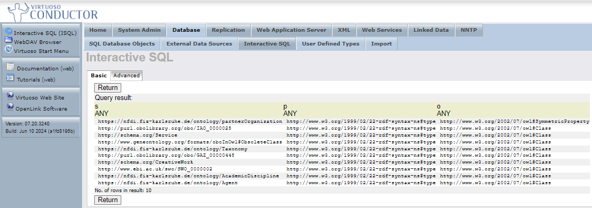

# RDF Insert Methods in Virtuoso
## Loading RDF Datasets into a Virtuoso Graph IRI
Virtuoso supports various methods for inserting RDF data into its triple store. Below are the steps for loading RDF datasets, applicable to both TTL and RDF/XML formats. Specific differences in commands for each format are highlighted separately.
<details>

### Method 1: Using Command Prompt

#### Common Steps for Loading RDF Data

1. **Prepare the RDF Data File**  
   Ensure your RDF data is in the correct file format:
   - Turtle (TTL)
   - RDF/XML

2. **Start Virtuoso**  
   Ensure that your Virtuoso server is running.

3. **Connect to Virtuoso Using isql**  
   Open a terminal and connect to your Virtuoso instance:
   ```bash
   $ isql 1111 dba mysecret
   ```

4. **Loading RDF Data**  
   
   **Loading TTL Data**  
   To load a Turtle (TTL) file, use the `DB.DBA.TTLP_MT` function:
   ```sql
   SQL> DB.DBA.TTLP_MT(file_to_string_output('/path/to/your/file.ttl'), '', 'http://example.com/graph', 0, 2, 4, 1);
   ```

   **Loading RDF/XML Data**  
   To load an RDF/XML file, use the `DB.DBA.RDF_LOAD_RDFXML_MT` function:
   ```sql
   SQL> DB.DBA.RDF_LOAD_RDFXML_MT(file_to_string_output('/path/to/your/file.rdf'), '', 'http://example.com/graph', 2, 4, 1);
   ```

   **Guide to Parameters:**
   1. `file_to_string_output('/path/to/your/file.ttl' or '/path/to/your/file.rdf')`: Path to your TTL or RDF/XML file.
   2. `''`: Base IRI (leave as an empty string if not needed).
   3. `'http://example.com/graph'`: The target graph IRI where the triples will be stored.
   4. `0` or `2`: Parsing/logging mode (0 for TTL, 2 for RDF/XML to log everything).
   5. `4`: Number of threads to use for loading.
   6. `1`: Transactional mode (0 for non-transactional, 1 for transactional).


5. **Verifying Data Load**  
   After loading the data, you can verify the import by running a SPARQL query:
   ```sql
   SQL> sparql
   SELECT * 
   FROM <http://example.com/graph>
   WHERE { ?s ?p ?o }
   LIMIT 10;
   ```

7. **Committing the Transaction**  
   If you are running in transactional mode, ensure the data is saved by committing the transaction:
   ```sql
   SQL> commit work;
   ```
### Method 2: Using Virtuoso Conductor (User Interface)

#### Step-by-Step Guide to Upload RDF Data Using Quad Store Upload

1. **Prepare Your RDF File**  
   Make sure your RDF data is in a proper Turtle (.ttl) or RDF/XML (.rdf) format.

2. **Open Virtuoso Conductor Interface**  
   Open your web browser and navigate to the Virtuoso Conductor interface at `http://localhost:8890/conductor`.

3. **Navigate to Linked Data > Quad Store Upload**  
   In the Conductor interface, click on *Linked Data* in the left-hand menu. Select *Quad Store Upload* to open the RDF data upload form.

4. **Upload RDF File**  
   Click on the *Choose file* button and select your RDF file from your local machine.

5. **Set Target Graph IRI**  
   Specify a meaningful Named Graph IRI where the data will be stored, e.g., `http://example.com/NFDI_Ontology`.

6. **Start Import**  
   Click on the *Upload* button to start the import process. Virtuoso will upload the file and insert the triples into the specified graph.

7. **Verify Import**  
   Open *Interactive SQL* in the Conductor interface and run a SPARQL query to verify that the data has been loaded correctly:
   ```sparql
   SPARQL
   SELECT * 
   FROM <http://example.com/NFDI_Ontology>
   WHERE { ?s ?p ?o }
   LIMIT 10;
   ```
   
</details>

---

## Bulk Loading of RDF Datasets into Virtuoso
This guide outlines the steps for bulk loading large RDF datasets into Virtuoso, which may involve multiple files and loading them into one or several graphs.
<details>

### Prerequisites
- **Virtuoso Bulk Loader Functions**: Ensure these functions are available (pre-loaded in Virtuoso 06.02.3129 and later).
- **Directory Permissions**: The directory containing the RDF files must be listed in the `DirsAllowed` parameter in the Virtuoso INI file, followed by a server restart.
- **System Configuration**: Configure memory and resources as per the Virtuoso RDF Performance Tuning Guide.
- **Supported File Formats**: Files must be in .grdf, .nq, .nt, .owl, .rdf, .trig, .ttl, .xml, or compressed formats (.gz, .bz2, .xz).

### Bulk Loading Process

#### Specify Graph IRI
Place the graph IRI, e.g., `http://dbpedia.org`, in a `.graph` file in the same directory as the RDF files.

#### Register Files for Loading
Use `ld_dir()` or `ld_dir_all()` to register files for bulk loading:
```sql
SQL> ld_dir ('/path/to/files', '*.n3', 'http://dbpedia.org');
```

#### Check Registered Files
Use `DB.DBA.load_list` to check the list of registered files:
```sql
SQL> select * from DB.DBA.load_list;
```

#### Execute Bulk Load
Run the bulk load by calling the `rdf_loader_run()` function:
```sql
SQL> rdf_loader_run();
```

#### Finalize Loading
Run a checkpoint to ensure the data is committed:
```sql
SQL> checkpoint;
```

### Running Multiple Loaders
For optimal performance, run multiple loader processes in parallel:
```bash
isql 1111 dba dba exec="rdf_loader_run();" &
isql 1111 dba dba exec="rdf_loader_run();" &
...
wait
isql 1111 dba dba exec="checkpoint;";
```

### Stopping the Bulk Load Process
All RDF loader threads can be stopped using:
```sql
SQL> rdf_load_stop();
```

### Checking Bulk Load Status
Check the `DB.DBA.load_list` to confirm successful loads:
```sql
SQL> select * from DB.DBA.LOAD_LIST where ll_error IS NOT NULL;
```
</details>

---

## Virtuoso CSV File Bulk Loader
The Virtuoso CSV File Bulk Loader enables efficient bulk loading of CSV files into Virtuoso, storing them as tables. This section provides an overview of the key functions, configuration steps, and examples of usage.
<details>

### CSV Bulk Load Functions
The following functions are used for performing CSV bulk load operations:
- `csv_register(path, mask)`: Registers CSV files matching the mask in the specified directory.
- `csv_register_all(path, mask)`: Registers CSV files recursively from the specified directory.
- `csv_loader_run(max_files, log_enable := 2)`: Executes the bulk loader to load data into the database. You can specify the maximum number of files and set `log_enable=2` to minimize locks during the load.

### Configuration and Usage

1. **Directory Configuration**  
   Ensure all directories containing CSV files to be loaded are included in the `DirsAllowed` parameter of the active Virtuoso INI file.

2. **Table Creation (Optional)**  
   If a CSV file contains no headers indicating column names, create a table manually before importing. The CSV file will be loaded into this table.

3. **Table Mapping**  
   If you want to load a CSV file into a specific table, create a `.tb` file with the same name as the CSV file. This file should contain a single entry with the fully qualified name of the target table.

4. **CSV Configuration**  
   If the CSV file structure differs from the default configuration, create a `.cfg` file with the same name as the CSV file. This file should contain parameters that define the structure of the CSV file, such as delimiter, quote character, and header line.
   ```bash
   csv-delimiter=<delimiter char>
   csv-quote=<quote char>
   header=<zero based header offset>
   offset=<zero based data offset>
   ```
   - Invisible "tab" and "space" delimiters should be specified by those names, without the quotation marks.
   - Other delimiter characters (comma, period, etc.) should simply be typed in.
   - "Smart" quotation marks which differ at start and end (including but not limited to « », ‹ ›, “ ”, and ‘ ’) are not currently supported.


#### Example of a CSV Configuration File
Consider loading a gzipped CSV file, csv-example.csv.gz, with the non-default CSV structure below:
```csv
'Southern North Island wood availability forecast for the period 2008-2040'		
'Table 14: Wood availability and average clearfell age for other species in Eastern Southern North Island'		
'Year ending'	'Recoverable volume'	'Average age'
'December'	'(000 m3 i.b.)'	'(years)'
2006	0	0
2007	0	0
2008	48	49
2009	45	46
...
```
In this example
 - the header is on the third line, #2 with a zero-base
 - the data starts from the fifth line, #4 with a zero-base
 - the delimiter is tab
 - the quote char is the single-quote, or apostrophe
Loading this file requires the creation of a configuration file, csv-example.cfg, containing the entries:


This configuration tells Virtuoso how to interpret the CSV structure for proper loading.

### Loading CSV Files
1. **Register the CSV Files**  
   Register the CSV files to be loaded using the `csv_register()` function:
   ```sql
   csv_register ('./CSV', '*.gz');
   ```

2. **Execute Bulk Load**  
   Load the CSV files into Virtuoso by executing:
   ```sql
   csv_loader_run ();
   ```
</details>

---
