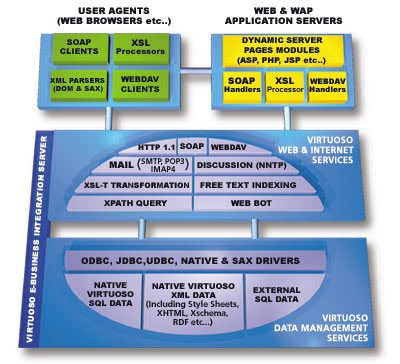

# What is Virtuoso?

Virtuoso is a high-performance object-relational SQL database that supports transactions, a smart SQL compiler, a powerful stored-procedure language, optional Java and .Net server-side hosting, hot backup, and SQL-99. It integrates major data-access interfaces like ODBC, JDBC, ADO .Net, and OLE/DB.

It includes a built-in web server for dynamic web pages and supports VSP, PHP, ASP .Net, SOAP, and REST for stored procedures. Virtuoso also features a WebDAV repository for hosting web content with versioning and metadata extraction, compatible with WebDAV clients in Windows XP and Mac OSX.

Virtuoso supports SPARQL embedded into SQL for querying RDF data, with type-casting rules and a dedicated IRI data type, enhancing its RDF data querying capabilities.

## Why Do I Need Virtuoso?

Virtuoso is essential because it unifies data from multiple sources, reducing costs and accelerating information production. As organizations increasingly rely on diverse data sources, Virtuoso simplifies data integration across different database engines.

It enhances the effectiveness of query tools, web applications, and development environments, enabling real-time creation of dynamic XML documents from varied SQL databases.

Virtuoso supports a wide range of industry standards, making it a powerful foundation for developing and deploying next-generation eBusiness solutions. It allows organizations to compete effectively in the Information Age by providing high-performance, cross-platform data access and integration solutions.

## Key Features of Virtuoso

- **Data Management**: Virtuoso handles typical database and virtual database tasks, collaborating between local native and remote SQL and XML-based resources.
- **Web Services Integration**: Virtuoso includes web and internet services and protocols that expose it to the web and its users.
- **SPARQL Support**: Virtuoso supports SPARQL embedded into SQL, allowing for RDF data querying, with enhanced type-casting and a dedicated IRI data type.

